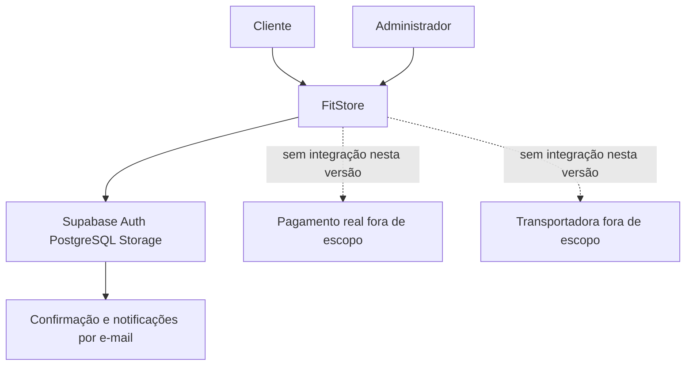

# Diagrama de Contexto

```mermaid
flowchart TB
  Client[Cliente] --> FitStore[FitStore]
  Admin[Administrador] --> FitStore
  FitStore --> Supabase[Supabase Auth PostgreSQL Storage]
  Supabase --> Email[Confirmação e notificações por e-mail]
  FitStore -. sem integração nesta versão .-> Payment[Pagamento real fora de escopo]
  FitStore -. sem integração nesta versão .-> Carrier[Transportadora fora de escopo]
```
